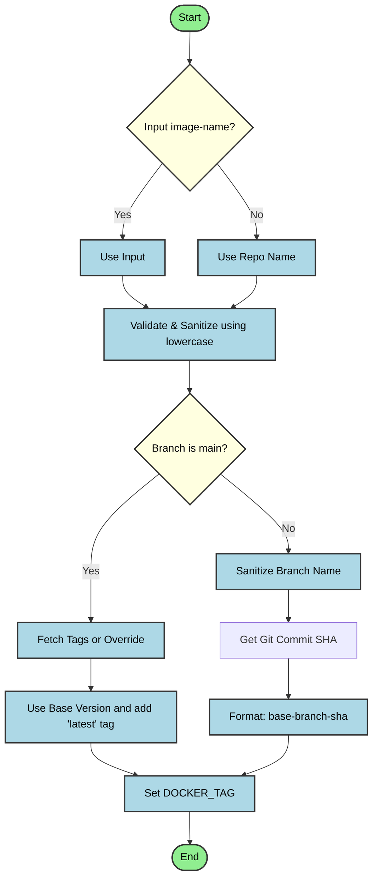

CI/CD Docker Build Workflow

A composite GitHub Action to build a Docker image. It automatically calculates the Docker tag based on the branch name and Git SHA, or uses the base version (with an additional `latest` tag) for the `main` branch.

## Inputs

| Name                | Description                                                                    | Required | Default                              |
| ------------------- | ------------------------------------------------------------------------------ | -------- | ------------------------------------ |
| `image-name`        | Name of the Docker image. If not provided, it defaults to the repository name. | `false`  | `github.repository` (repo name only) |
| `docker-build-path` | Path to the source code for Docker build.                                      | `false`  | `.`                                  |
| `appid`             | Application ID                                                                 | `false`  | `0`                                  |
| `orgid`             | Organization ID                                                                | `false`  | `0`                                  |
| `buid`              | Business Unit ID                                                               | `false`  | `0`                                  |

## Outputs

This action does not produce any direct outputs, but it builds a docker image with the tag available in the environment as `DOCKER_TAG`.

## Usage

```yaml
jobs:
  build:
    runs-on: ubuntu-latest
    steps:
      - uses: actions/checkout@v4
        with:
          fetch-depth: 0

      - name: Build Docker Image
        uses: orbitcluster/oc-cicd-docker-build-workflow@v1
        with:
          image-name: my-app-image
          docker-build-path: ./app
          appid: "123"
          orgid: "456"
          buid: "789"
```

## Tag Calculation Logic



- **Main Branch**: Uses the base version determined by git tags or overrides (e.g., `v1.0.0`). The image is additionally tagged with `latest`.
- **Other Branches**: Formatted as `<base-version>-<safe-branch-name>-<short-sha>`, where:
  - `safe-branch-name`: Slashes `/` and underscores `_` are replaced with hyphens `-`.
  - `short-sha`: The 7-character Git commit SHA.

## Image Scanning

After building the image, this action automatically runs a security scan using `orbitcluster/oc-cicd-docker-scan-workflow@v1`.
