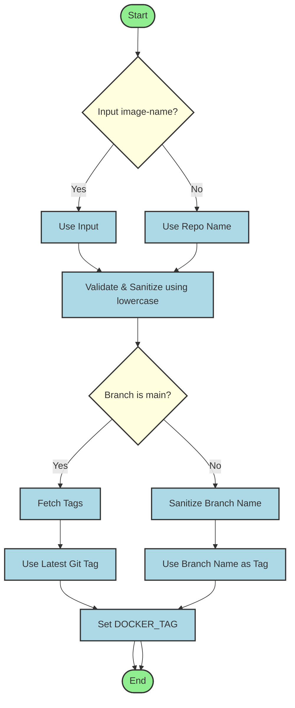

CI/CD Docker Build Workflow

A composite GitHub Action to build a Docker image. It automatically calculates the Docker tag based on the branch name and date, or uses the git tag for `main` branch.

## Inputs

| Name                | Description                                                                    | Required | Default                              |
| ------------------- | ------------------------------------------------------------------------------ | -------- | ------------------------------------ |
| `image-name`        | Name of the Docker image. If not provided, it defaults to the repository name. | `false`  | `github.repository` (repo name only) |
| `docker-build-path` | Path to the source code for Docker build.                                      | `false`  | `.`                                  |

## Outputs

This action does not produce any direct outputs, but it builds a docker image with the tag available in the environment as `DOCKER_TAG`.

## Usage

```yaml
jobs:
  build:
    runs-on: ubuntu-latest
    steps:
      - uses: actions/checkout@v4

      - name: Build Docker Image
        uses: orbitcluster/oc-cicd-docker-build-workflow@v1
        with:
          image-name: my-app-image
          docker-build-path: ./app
```

## Tag Calculation Logic



- **Main Branch**: Uses the latest git tag (e.g., `v1.0.0`).
- **Other Branches**: Formatted as `<branch-name>`, where slashes `/` are replaced with hyphens `-`.

## Image Scanning

After building the image, this action automatically runs a security scan using `orbitcluster/oc-cicd-docker-scan-workflow@v1`.
